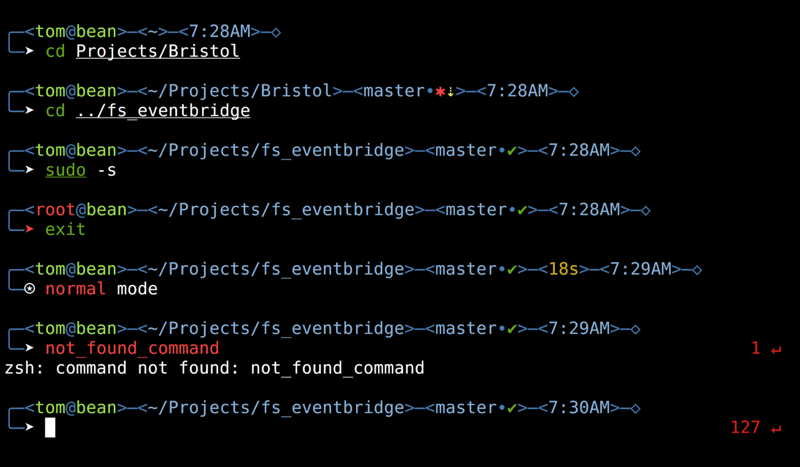

# Frost

> Distinct, informative, and fast ZSH prompt



## Overview

Frost is a sexy, featureful prompt that stands out in the crowd of console output.

It's also based on the incredible [Pure](https://github.com/sindresorhus/pure) from Sindre Sorhus, so it's asynchronous and fast as hell.

### Why?

- Comes with the _actual_ perfect prompt character.
  [Pure](https://github.com/sindresorhus/pure) author has no idea what he's talking about.
- Works independently of any frameworks. You don't need oh-my-zsh or prezto bloat to run Frost.
- Shows `git` branch and whether it's dirty or clean (with a `✱` or a `✔`).
- Indicates when you have unpushed/unpulled `git` commits with up/down arrows. *(Check is done asynchronously!)*
- Shows a right-prompt with the last command's exit code if it wasn't `0`.
- Command execution time will be displayed if it exceeds the set threshold.
- Username and host displayed all the time for the paranoid. User appears red if it's root, host appears yellow if it's
  remote.
- Shows the current path in the title and the current folder & command when a process is running.
- Visually shows vi-mode users when they're in Insert mode versus Normal mode, changing the prompt character for each. 
- Wickedly easy to edit for different color schemes.

## Install

Can be installed via a plugin manager or manually. Requires Git 2.0.0+ and ZSH 5.2+. Older versions of ZSH are known to work, but they are **not** recommended.

### Manually

1. Either…
  - Clone this repo
  - add it as a submodule, or
  - just download `frost.zsh` and `async.zsh`

2. Symlink `frost.zsh` to somewhere in [`$fpath`](http://www.refining-linux.org/archives/46/ZSH-Gem-12-Autoloading-functions/) with the name `prompt_frost_setup`.

3. Symlink `async.zsh` in `$fpath` with the name `async`.

#### Example

```console
$ ln -s "$PWD/frost.zsh" /usr/local/share/zsh/site-functions/prompt_frost_setup
$ ln -s "$PWD/async.zsh" /usr/local/share/zsh/site-functions/async
```
*Run `echo $fpath` to see possible locations.*

For a user-specific installation (which would not require escalated privileges), simply add a directory to `$fpath` for that user:

```sh
# .zshenv or .zshrc
fpath=( "$HOME/.zfunctions" $fpath )
```

Then install the theme there:

```console
$ ln -s "$PWD/frost.zsh" "$HOME/.zfunctions/prompt_frost_setup"
$ ln -s "$PWD/async.zsh" "$HOME/.zfunctions/async"
```


## Getting started

Initialize the prompt system (if not so already) and choose `frost`:

```sh
# .zshrc
autoload -U promptinit; promptinit
prompt frost
```

## Options

### `FROST_SHOW_CLOCK`

Set `FROST_SHOW_CLOCK=0` to eliminate the clock from the prompt. Defaults to `1`.

### `FROST_SHOW_EXEC_TIME`

Set `FROST_SHOW_EXEC_TIME=0` to prevent showing the command execution time regardless of the duration. Defaults to `1`.

### `FROST_CMD_MAX_EXEC_TIME`

The max execution time of a process before its run time is shown when it exits. Defaults to `5` seconds.

### `FROST_GIT_PULL`

Set `FROST_GIT_PULL=0` to prevent Frost from checking whether the current Git remote has been updated.

### `FROST_GIT_UNTRACKED_DIRTY`

Set `FROST_GIT_UNTRACKED_DIRTY=0` to not include untracked files in dirtiness check. Only really useful on extremely huge repos like the WebKit repo.

### `FROST_GIT_DELAY_DIRTY_CHECK`

Time in seconds to delay git dirty checking for large repositories (git status takes > 2 seconds). The check is performed asynchronously, this is to save CPU. Defaults to `1800` seconds.

### `FROST_PCHAR_INSERT`

For the default emacs mode, this defines the prompt symbol. For vi mode, this is the prompt symbol used in insert mode. The default value is `➤`.

### `FROST_PCHAR_NORMAL`

For vi mode, this is the prompt symbol used in normal mode. The default value is `⊙`.

### `FROST_GIT_DOWN_ARROW`

Defines the git down arrow symbol. The default value is `⇣`.

### `FROST_GIT_UP_ARROW`

Defines the git up arrow symbol. The default value is `⇡`.

## Example

```sh
# .zshrc

autoload -U promptinit; promptinit

# optionally define some options
FROST_CMD_MAX_EXEC_TIME=10

prompt frost
```

## Tips

Frost uses a small number of characters that appear wildly different between fonts. Due to the very fancy curved line
connecting the preprompt with the ZLE prompt, line spacing is also quite important. There are a small number of fonts
that work well with both these cases. My favorite is [Droid Sans Mono](https://fonts.google.com/specimen/Droid+Sans+Mono)
which is also happily provided in the [Powerline-patched font pack](https://github.com/powerline/fonts). This is
pictured in the screenshot.

Also note that this prompt is intended for terminals that render "bold" text in brighter colors of the same weight.

To have commands colorized as seen in the screenshot, install [zsh-syntax-highlighting](https://github.com/zsh-users/zsh-syntax-highlighting).

## Integration

### [oh-my-zsh](https://github.com/robbyrussell/oh-my-zsh)

1. Symlink (or copy) `frost.zsh` to `~/.oh-my-zsh/custom/frost.zsh-theme`.
2. Symlink (or copy) `async.zsh` to `~/.oh-my-zsh/custom/async.zsh`.
3. Set `ZSH_THEME="frost"` in your `.zshrc` file.

Or skip the `oh-my-zsh` integration above and simply:

1. Set `ZSH_THEME=""` in your `.zshrc` to disable oh-my-zsh themes.
2. Follow the Frost [Install](#install) instructions.

### [prezto](https://github.com/zsh-users/prezto)

1. Symlink (or copy) `frost.zsh` to `~/.zprezto/modules/prompt/functions/frost_prompt_setup`
2. Symlink (or copy) `async.zsh` to `~/.zprezto/modules/prompt/functions/async`
3. Set `zstyle ':prezto:module:prompt' theme 'frost'` in `~/.zpreztorc`.

### [antigen](https://github.com/zsh-users/antigen)

Update your `.zshrc` file with the following two lines (order matters). Do not use the `antigen theme` function.

```sh
antigen bundle mafredri/zsh-async
antigen bundle tomfrost/frost-zsh-prompt
```

### [antibody](https://github.com/getantibody/antibody)

Update your `.zshrc` file with the following two lines (order matters):

```sh
antibody bundle mafredri/zsh-async
antibody bundle tomfrost/frost-zsh-prompt
```

### [zplug](https://github.com/zplug/zplug)

Update your `.zshrc` file with the following two lines:

```sh
zplug mafredri/zsh-async, from:github
zplug tomfrost/frost-zsh-prompt, use:frost.zsh, from:github, as:theme
```

## FAQ

This handy FAQ is provided by (and frequently references) [Pure](https://github.com/sindresorhus/pure), which Frost has been based on. Each of these items still apply.

### My preprompt is missing when I clear the screen with Ctrl+L

Pure doesn't register its custom *clear-screen* widget if it has been previously modified. If you haven't registered your own zle widget with `zle -N clear-screen custom-clear-screen` it might have been done by third-party modules. For example `zsh-syntax-highlighting` and `zsh-history-substring-search` are known to do this and they should for that reason be **the very last thing** in your `.zshrc` (as pointed out in their documentation).

To find out the culprit that is overriding your *clear-screen* widget, you can run the following command: `zle -l | grep clear-screen`.

### I am stuck in a shell loop in my terminal that ask me to authenticate. What should I do ?

[This is a known issue](https://github.com/sindresorhus/pure/issues/76).
Using `git pull` when you get the username prompt should help you to break the loop by giving you a real prompt for this. **[This has been fixed in git 2.3](https://github.com/sindresorhus/pure/commit/f43ab97e1cf4a276b7a6e33eac055ee16610be15)**

### I am seeing the error `zpty: can't open pseudo terminal: bad file descriptor`.

[This is a known issue](https://github.com/sindresorhus/pure/issues/117). `zsh/zpty` requires either legacy bsd ptys or access to `/dev/ptmx`. Here are some known solutions.

#### Gentoo

```console
$ sudo sh -c "echo 'SANDBOX_WRITE=\"/dev/ptmx\"' > /etc/sandbox.d/10zsh"
$ sudo emerge -1 zsh
```

#### FreeBSD 10.1

On a default setup, running the command `kldload pty` should do the trick. If you have a custom kernel, you might need to add `device pty` to the configuration file ([example](https://github.com/nbari/freebsd/blob/58646a9c3c4aaabf6f6467ff505f27f09e29dc75/kernels/xen.kernel#L188)).

## License

Frost-zsh-prompt is Copyright Tom Shawver (MIT)  
Pure, on which this prompt is based, is Copyright [Sindre Sorhus](http://sindresorhus.com) (MIT)

